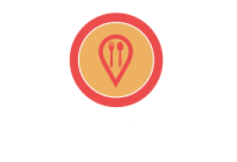
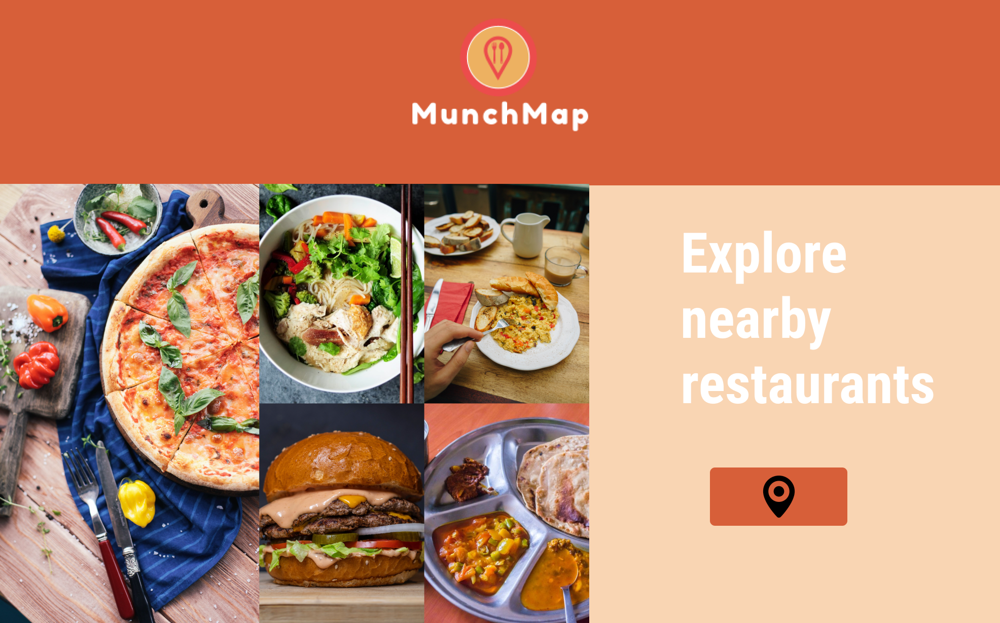
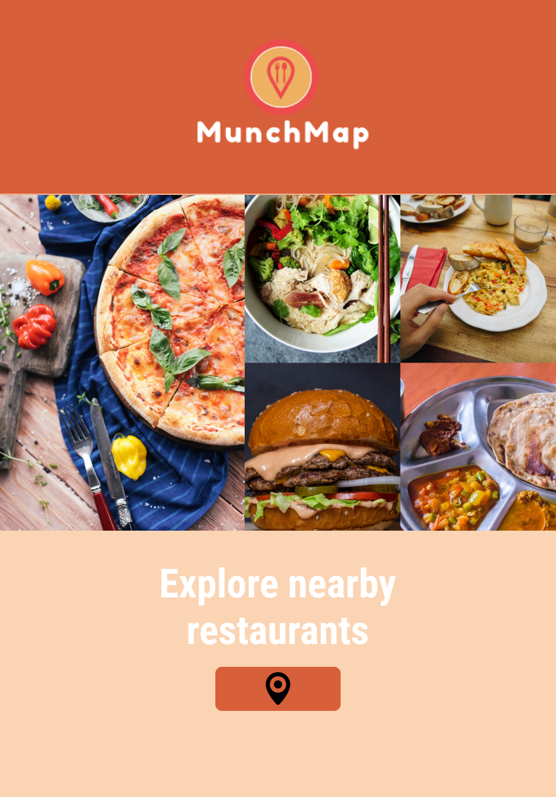
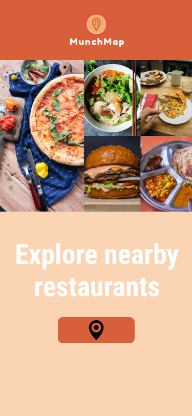
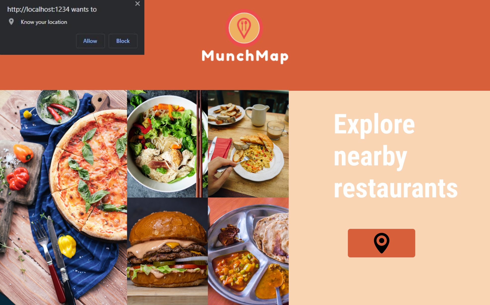
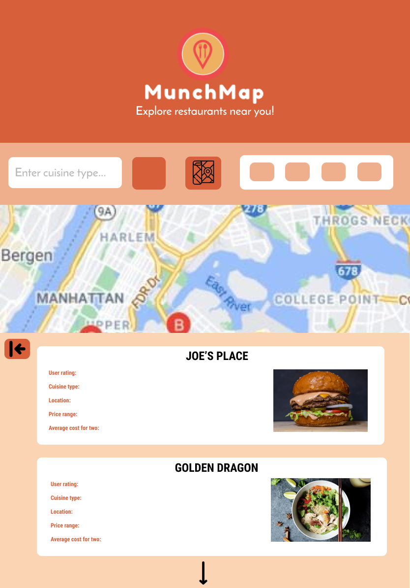
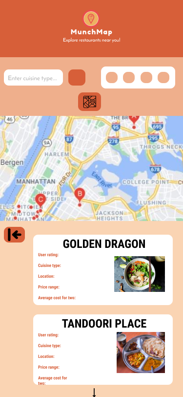
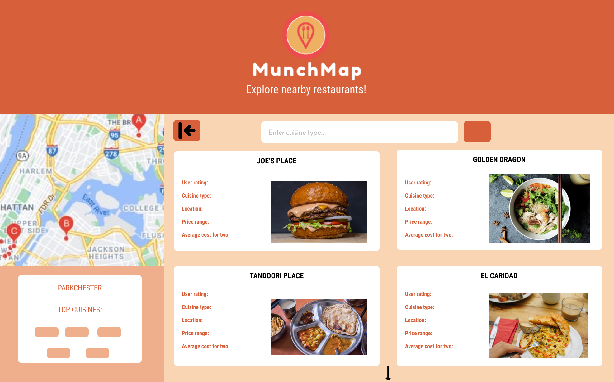
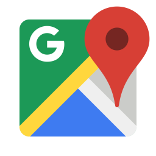

# Munch-Map

## 🗺 About 📍

Munch Map is a platform where users can explore local restaurants and see them in real-time on a map. The purpose of Munch Map is to familiarize users to local restaurants. This idea was driven by the struggle of our community during these difficult times.

> Features
>
> - Utilizes location services to find user
> - Lists all local restaurants
> - View restaurants on map
> - Filter restaurants by cuisine, ratings, pricing
>
> Goals
> - Bring local restaurants to the users
> - Help local restaurants gain exposure

## 🛠 Wireframing 🛠
 [App concept from figma](https://www.figma.com/file/9HXuSGXvXWuvlRHAyXsm9u/Final-Project-P1-Munch-Map?node-id=0%3A1)
 | Logo                                                  |
 | ----------------------------------------------------- |
 |  |
 | Work in Progress                                      |

| Desktop                                                         | Tablet                                                        | Mobile                                                        |
| --------------------------------------------------------------- | ------------------------------------------------------------- | ------------------------------------------------------------- |
|  |  |  |
|         |            |            |
|            |                                                               |
## 💻 API 💻

The following are the API utilized by Munch Map

 | Zomato API                                                                                                                                    | Google Maps API                                                                                            |
 | --------------------------------------------------------------------------------------------------------------------------------------------- | ---------------------------------------------------------------------------------------------------------- |
 |                                                          |                |
 | "Zomato APIs give you access to the freshest and most exhaustive information for over 1.5 million restaurants across 10,000 cities globally." | "Build customized, agile experiences that bring the real world to your users with static and dynamic maps" |

## 🗓 Additional 📌
Features we would like to add in the future:
> - [Direction services](https://developers.google.com/maps/documentation/javascript/examples/directions-complex#maps_directions_complex-html)
> - [Adding stock food images](https://meet.google.com/linkredirect?authuser=0&dest=https%3A%2F%2Fwww.pexels.com%2Fapi%2F)
> - [Styling the map](https://developers.google.com/maps/documentation/javascript/examples/map-id-style)

## 📚 Resources 📚
Munch Map would not be possible without these sources:
> - [Github public API list](https://github.com/public-apis/public-apis)
> - [CSS frameworks: Bootstrap lesson by Colt Steele](https://www.udemy.com/course/the-web-developer-bootcamp)
> - [Figma](https://www.figma.com/)
> - [Google Maps tutorial by Brad Traversey](https://www.youtube.com/c/TraversyMedia/videos)
> - [Axios Documentation](https://github.com/axios/axios)

## 🤙 Contact 🤙

| Angel Fernandez                                                                                                                                                                   | Shafee Ahmed                                                                                                                                                            |
| --------------------------------------------------------------------------------------------------------------------------------------------------------------------------------- | ----------------------------------------------------------------------------------------------------------------------------------------------------------------------- |
|   |   |
|                                                                                                                                                                                   |                                                                                                                                                                         |
